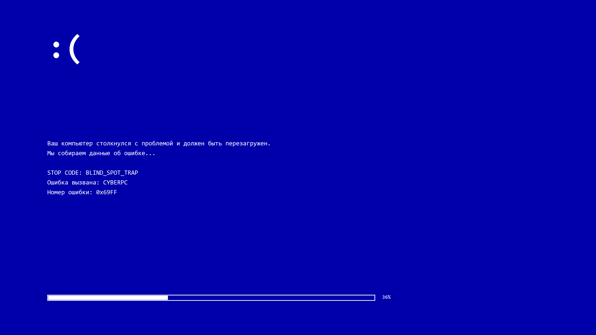
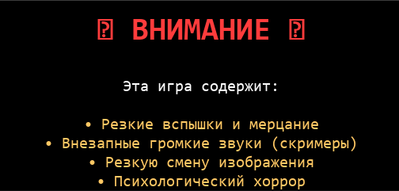

# Слепая зона (Blind Spot)

> ⚠️ **ПРЕДУПРЕЖДЕНИЕ О БЕЗОПАСНОСТИ**
>
> Эта игра содержит:
> - **Резкие вспышки и мерцание экрана**
> - **Внезапные громкие звуки** (скримеры)
> - **Резкую смену изображения** (BSOD, красные экраны)
> - **Психологический и мета-хоррор**
> - **Сцены, ломающие «четвёртую стену»** (игра обращается к игроку по имени пользователя)
>
> **Если у вас фоточувствительная эпилепсия, мигрени, тревожные расстройства или проблемы с сердцем — НЕ ИГРАЙТЕ.**
>
> Игра **безвредна** для компьютера, но **намеренно пугает** игрока.
> Демо-версия создаёт файл `names_pets.txt` на рабочем столе. Файл безопасен и содержит только текст.

## ⚠️ Антивирус

Если Windows SmartScreen или антивирус ругается на `.exe` — это
**ложное срабатывание** PyInstaller. Игра безопасна, весь код —
в этом репозитории. Можете проверить на VirusTotal.

---

**Мета-хоррор про питомцев, которые знают больше, чем должны.**

## 👥 Авторы — FTK Development
- **Кислый Лайм** — сценарий, сюжет, персонажи
- **iFastek** — код, архитектура, финал
- **Nick** — помощь с кодом (iFastek)

## 🚀 Установка и запуск

```bash
pip install -r requirements.txt
python main.py
```

## 📸 Скриншоты





## 🎮 Управление

| Клавиша | Действие |
|---------|----------|
| **ЛКМ** | Выбор, ввод |
| **Enter** | Подтвердить имя |
| **Backspace** | Стереть символ |
| **F5** | Сохранить |
| **F9** | Загрузить |
| **ESC** | Меню / закрыть справку |

## ⚠️ Файл на рабочем столе

После финала игра создаёт `names_pets.txt` на рабочем столе.
Файл **безвреден** — обычный текст с именами петов.
Если не хотите — просто удалите. Больше игра ничего не трогает.

## 📜 Лицензия

MIT